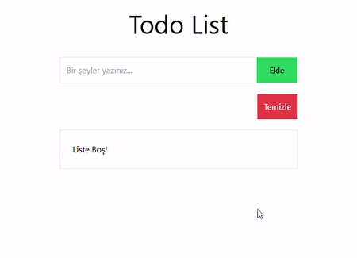

# 🏠Todo-List-Project

In this repo, a to-do list is designed using Html, Css, JavaScript and Tailwind.

# 🚀Features

-Responsive Design

-User-Friendly Interface

-Simple and Convenient Working Structure

# 🛠️Technologies Used

-Html

-Css

-Js

-Tailwind

# Screenshot

# 📨Contact

Please contact us for your questions, comments and suggestions.:fratsbht@icloud.com

